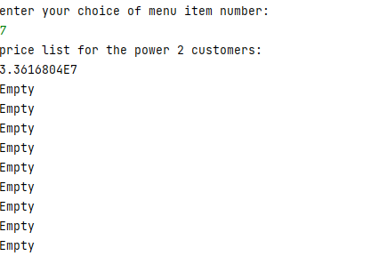

# *warehouse-management-2*
It's an extension of Warehouse-management-2.
You can find warehouse-management-1
[***HERE***](https://github.com/rayallavandana/warehouse-management-1/blob/branch)

It's an another java console application.
Firstly,it will ask for the maximum number of places or spaces present in the shelf.
After that it displays the menu.
Here's is the menu:
After displaying menu,it asks to choose an menu item

## 1.Add computers
The application asks the user which shelf space the computer should be stored. 
Afterward, the application asks the user for all specifications of a computer and adds the computer to the specified shelf space.

## 2.Remove computers
The application asks the user for the shelf space that should be removed. Afterward, 
the application removes the computer from the shelf space.

## 3.Filter computers
The application asks the user to input a search term(e.g. Dell, Len, Lenovo, t470, t470p, or any other part of a brandName or modelName to filter the computers).

## 4.Print the information for all computers
The application prints the information for all computers on the shelf. 
It should print "empty" if there is no computer on the shelf space.

## 5.Print a price list for all computers
The application prints the price for each computer on the shelf.

## 6.Print a price list for the Sqrt-Customer
One of your customers is a really important , 
who is only able to read the price of a product if the square root of the price is calculated before,It becomes easy.

## 7.Print a price list for the Power2-Customer
Another of your customers is also a really important, 
who on the other side is only able to read the price of a product if the price is raised to the power 2 before,It becomes easy.

## 8.Close the application
The application will close.

